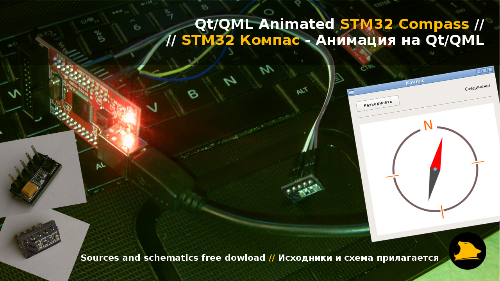

# STM32 Qt/QML Animated Compass

###How to...
1. Connect modules as shown on "Connection.png"
2. Flash firmware into MCU
3. Run "Qt Project/Linux AMD64 Binary/Compass" and press "Connect" button
4. ssss

- In video I use my own built HMC5883L module (OSHPark.com printed PCB, ICs bought on Aliexpress.com), you can use any
- PC Binaries built for Linux AMD64 but you can build it for any other platform with QtCreator

###Project demo Video/Photo
- YouTube demo video URL: https://www.youtube.com/watch?v=Z_zT6ZBXQdI
- Yandex Disk folder URL: https://yadi.sk/d/QCIbs8Pc33cuTA
